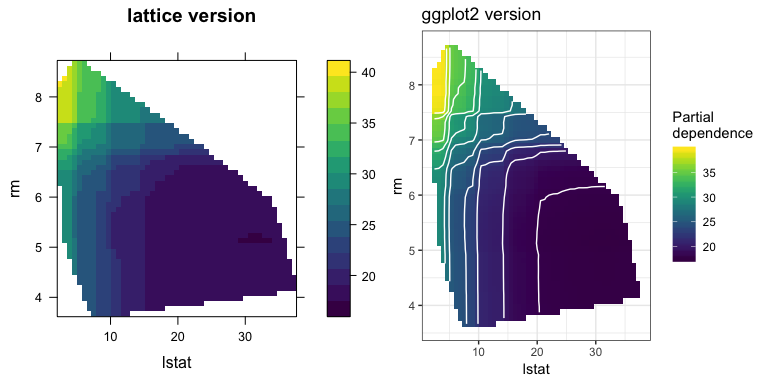
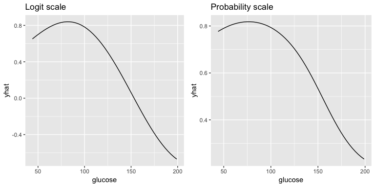
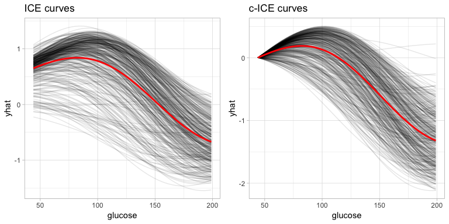
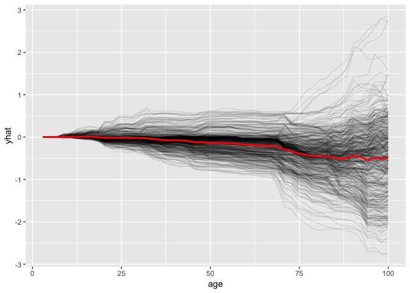

pdp 
===========================================================================

[](https://cran.r-project.org/package=pdp)
[](https://travis-ci.org/bgreenwell/pdp)
[](https://ci.appveyor.com/project/bgreenwell/pdp)
[](https://codecov.io/github/bgreenwell/pdp?branch=master)
[](http://cranlogs.r-pkg.org/badges/pdp)
[](http://cranlogs.r-pkg.org/badges/grand-total/pdp)

Overview
--------

Complex nonparametric models—like neural networks, random forests, and
support vector machines—are more common than ever in predictive
analytics, especially when dealing with large observational databases
that don’t adhere to the strict assumptions imposed by traditional
statistical techniques (e.g., multiple linear regression which assumes
linearity, homoscedasticity, and normality). Unfortunately, it can be
challenging to understand the results of such models and explain them to
management. Partial dependence plots offer a simple solution. Partial
dependence plots are low-dimensional graphical renderings of the
prediction function *f̂*(**x**) so that the relationship between the
outcome and predictors of interest can be more easily understood. These
plots are especially useful in explaining the output from black box
models. The `pdp` package offers a general framework for constructing
partial dependence plots for various types of fitted models in R.

A detailed introduction to `pdp` has been published in The R Journal:
“pdp: An R Package for Constructing Partial Dependence Plots”,
<https://journal.r-project.org/archive/2017/RJ-2017-016/index.html>. You
can track development at <https://github.com/bgreenwell/pdp>. To report
bugs or issues, contact the main author directly or submit them to
<https://github.com/bgreenwell/pdp/issues>.

As of right now, `pdp` exports four functions:

-   `partial` - compute partial dependence functions (i.e., objects of
    class `"partial"`) from various fitted model objects;
-   `plotPartial"` - plot partial dependence functions (i.e., objects of
    class `"partial"`) using `lattice` graphics;
-   `autoplot` - plot partial dependence functions (i.e., objects of
    class `"partial"`) using `ggplot2` graphics;
-   `topPredictors` extract most “important” predictors from various
    types of fitted models.

Installation
------------

The `pdp` package is [currently listed on
CRAN](https://CRAN.R-project.org/package=pdp) and can easily be
installed:

``` r
  # Install from CRAN (recommended)
  install.packages("pdp")
  
  # Alternatively, install the development version from GitHub
  devtools::install_github("bgreenwell/pdp")
```

Random forest example
---------------------

As a first example, we’ll fit a random forest to the famous Boston
housing data included with the package (see `?boston` for details). In
fact the original motivation for this package was to be able to compute
two-predictor partial dependence plots from random forest models in R.

``` r
# Fit a random forest to the Boston housing data
library(randomForest)  # install.packages("randomForest")
data (boston)  # load the boston housing data
set.seed(101)  # for reproducibility
boston.rf <- randomForest(cmedv ~ ., data = boston)

# Partial dependence of cmedv on lstat and rm
library(pdp)
pd <- partial(boston.rf, pred.var = c("lstat", "rm"), chull = TRUE)
head(pd)  # print first 6 rows
#>     lstat      rm     yhat
#> 1  7.5284 3.66538 24.47697
#> 2  8.2532 3.66538 23.63350
#> 3  8.9780 3.66538 23.47622
#> 4  9.7028 3.66538 22.38777
#> 5 10.4276 3.66538 20.88819
#> 6 11.1524 3.66538 20.79452

# Lattice version
p1 <- plotPartial(pd, main = "lattice version")

# ggplot2 version
library(ggplot2)
p2 <- autoplot(pd, contour = TRUE, main = "ggplot2 version", 
               legend.title = "Partial\ndependence")

# Show both plots in one figure
grid.arrange(p1, p2, ncol = 2)
```



You can also plot the output directly from `partial()` (although, this
is typically not recommended; see the [above-mentioned
paper](https://journal.r-project.org/archive/2017/RJ-2017-016/index.html)
for details):

``` r
partial(boston.rf, pred.var = c("lstat", "rm"), chull = TRUE, plot = TRUE,
        plot.engine = "ggplot2", palette = "magma", alpha = 0.9,
        contour = TRUE, contour.color = "white")
```


Next, we’ll fit a classification model to the Pima Indians Diabetes
data.

Support vector machine (SVM) example
------------------------------------

As a second example, we’ll fit an SVM to the Pima Indians diabetes data
included with the package (see `?pima` for details). Note that for some
fitted model objects (e.g., `"ksvm"` objects) it is necessary to supply
the original training data via the `train` argument in the call to
`partial()`.

``` r
# Fit an SVM to the Pima Indians diabetes data
library(kernlab)  # install.packages("kernlab")
data (pima)  # load the Pima Indians diabetes data
pima.svm <- ksvm(diabetes ~ ., data = pima, type = "C-svc", kernel = "rbfdot",
                 C = 0.5, prob.model = TRUE)
 
# Partial dependence of diabetes test result on glucose (default is logit scale)
pd.glucose <- partial(pima.svm, pred.var = "glucose", train = pima)

# Partial dependence of diabetes test result on glucose (probability scale)
pd.glucose.prob <- partial(pima.svm, pred.var = "glucose", prob = TRUE, 
                           train = pima)

# Show both plots in one figure
grid.arrange(autoplot(pd.glucose, main = "Logit scale"), 
             autoplot(pd.glucose.prob, main = "Probability scale"), 
             ncol = 2)
```



Individual conditional expectation (ICE) plots
----------------------------------------------

PDPs can be misleading in the presence of substantial interactions
[(Goldstein et al.,
2015)](https://www.tandfonline.com/doi/full/10.1080/10618600.2014.907095).
To overcome this issue Goldstein, Kapelner, Bleich, and Pitkin developed
the concept of individual conditional expectation (ICE) plots—available
in the [`ICEbox`](https://cran.r-project.org/package=ICEbox) package.
ICE plots display the estimated relationship between the response and a
predictor of interest for each observation. Consequently, the PDP for a
predictor of interest can be obtained by averaging the corresponding ICE
curves across all observations. Starting with `pdp` version 0.6.0, ICE
and centered ICE (c-ICE) curves can be easily obtained using the `ice`
and `center` options; c-ICE plots help visualize heterogeneity in the
modeled relationship between observations. Derivative ICE (d-ICE) plots
(**coming soon**) help to explore interaction effects.

``` r
# Load required packages
library(ggplot2)  # for additional themes

# ICE and c-ICE curves of diabetes test result on glucose (default logit scale)
ice.glucose <- partial(
  pima.svm, pred.var = "glucose", train = pima, ice = TRUE
)
cice.glucose <- partial(
  pima.svm, pred.var = "glucose", train = pima, ice = TRUE, center = TRUE
)

# Show both plots in one figure
grid.arrange(ncol = 2,
  autoplot(ice.glucose, alpha = 0.1, main = "ICE curves") + theme_light(), 
  autoplot(cice.glucose, alpha = 0.1, main = "c-ICE curves") + theme_light()
)
```



``` r
partial(
  boston.rf, pred.var = "age", ice = TRUE, center = TRUE, plot = TRUE,
  plot.engine = "ggplot2", alpha = 0.1
)
```



References
----------

Alex Goldstein, Adam Kapelner, Justin Bleich & Emil Pitkin (2014)
Peeking Inside the Black Box: Visualizing Statistical Learning With
Plots of Individual Conditional Expectation, Journal of Computational
and Graphical Statistics, 24:1, 44-65, DOI: 10.1080/10618600.2014.907095
