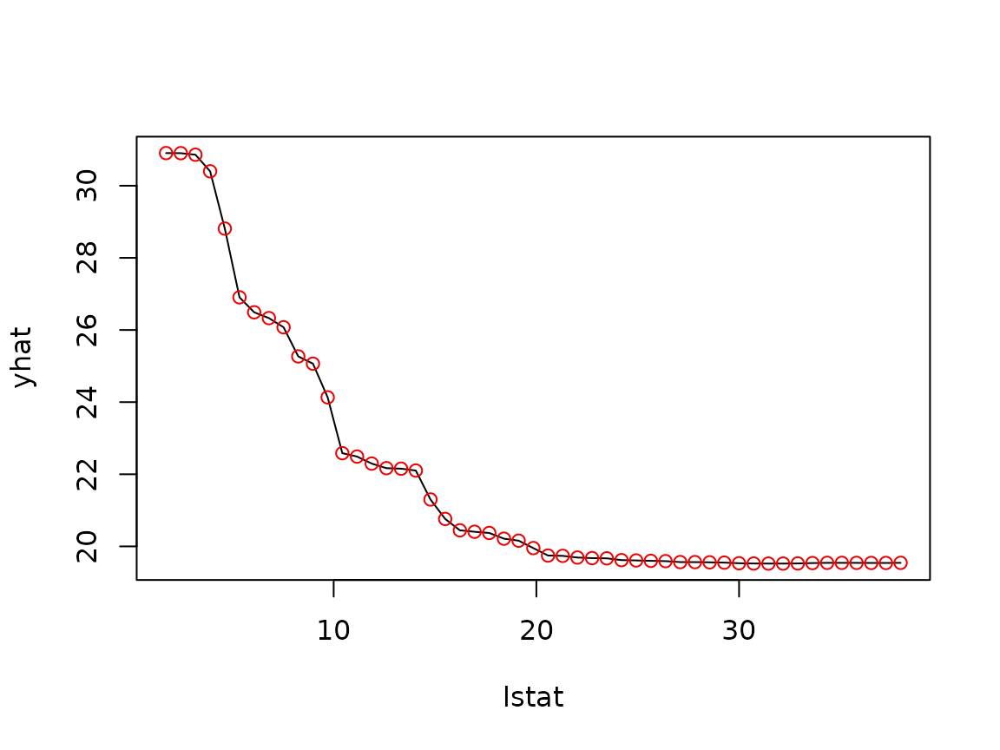
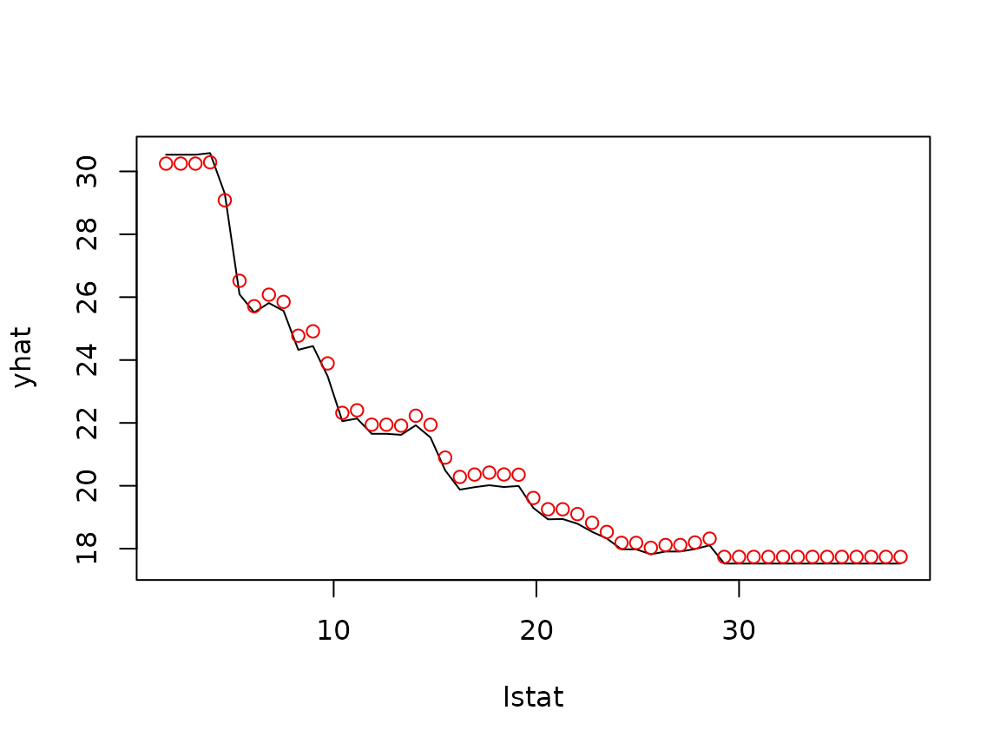

# Making pdp faster

Computing partial dependence is embarrassingly simple but potentially
expensive: for each point in the grid of predictor values, the model has
to score a modified copy of the entire training set. This vignette
covers the options **pdp** provides for speeding that up.

``` r

library(pdp)
library(randomForest)

data(boston)
set.seed(101)
boston.rf <- randomForest(cmedv ~ ., data = boston, ntree = 250)
```

## Batched predictions (`batch.size`)

By default,
[`partial()`](https://bgreenwell.github.io/pdp/reference/partial.md)
calls [`predict()`](https://rdrr.io/r/stats/predict.html) once per grid
point. Most [`predict()`](https://rdrr.io/r/stats/predict.html) methods
have non-trivial per-call overhead, so it is often much faster to
*stack* several grid points together and score them in a single call.
The `batch.size` argument specifies the (approximate) maximum number of
rows to score per call:

``` r

system.time(  # classic: one predict() call per grid point
  pd1 <- partial(boston.rf, pred.var = "lstat", train = boston)
)
#>    user  system elapsed 
#>   0.415   0.009   0.424
system.time(  # batched: score up to one million rows per predict() call
  pd2 <- partial(boston.rf, pred.var = "lstat", train = boston,
                 batch.size = 1e6)
)
#>    user  system elapsed 
#>   0.177   0.000   0.177
identical(pd1, pd2)
#> [1] TRUE
```

Batching only changes *how* the predictions are computed, not the
result. To see this, plot the classic curve and overlay the batched
results as points — they fall exactly on the curve:

``` r

plot(pd1)  # classic (line)
tinyplot::tinyplot_add(yhat ~ lstat, data = pd2, type = "p", col = "red2")
```



The trade-off is memory: with `batch.size = 1e6`, up to a million rows
are held in memory at once. Pick a batch size that comfortably fits your
machine. Note that `batch.size` requires the prediction function to
return one prediction per row of `newdata`, so it cannot be combined
with a `pred.fun` that aggregates its own predictions.

## Parallel processing

[`partial()`](https://bgreenwell.github.io/pdp/reference/partial.md) can
compute the grid points (or batches) in parallel via the
[foreach](https://cran.r-project.org/package=foreach) package. Register
a parallel backend (e.g., with **doParallel**) and set
`parallel = TRUE`:

``` r

library(doParallel)

cl <- makeCluster(4)  # use 4 workers
registerDoParallel(cl)
pd <- partial(boston.rf, pred.var = c("lstat", "rm"), chull = TRUE,
              train = boston, parallel = TRUE)
stopCluster(cl)
```

If the model’s [`predict()`](https://rdrr.io/r/stats/predict.html)
method lives in a package, pass it along via `paropts` (e.g.,
`paropts = list(.packages = "ranger")`) so the workers can find it.

## The recursive method for gbm

For **gbm** models,
[`partial()`](https://bgreenwell.github.io/pdp/reference/partial.md)
defaults to `recursive = TRUE`, which uses Friedman’s weighted tree
traversal method (implemented in C++) instead of the brute force
approach. It is *much* faster since it never has to touch the training
data:

``` r

library(gbm)

set.seed(103)
boston.gbm <- gbm(cmedv ~ ., data = boston, distribution = "gaussian",
                  n.trees = 500, interaction.depth = 3, shrinkage = 0.1)

system.time(
  pd.recursive <- partial(boston.gbm, pred.var = "lstat", n.trees = 500,
                          train = boston)  # recursive = TRUE is the default
)
#>    user  system elapsed 
#>   0.002   0.000   0.002
system.time(
  pd.brute <- partial(boston.gbm, pred.var = "lstat", n.trees = 500,
                      recursive = FALSE, train = boston, batch.size = 1e6)
)
#>    user  system elapsed 
#>   0.287   0.003   0.291
```

Overlaying the results shows that the two methods produce nearly the
same curve:

``` r

plot(pd.recursive)  # recursive (line)
tinyplot::tinyplot_add(yhat ~ lstat, data = pd.brute, type = "p", col = "red2")
```



The small differences are expected: rather than averaging predictions
over the training data, the recursive method weights each path through
the tree by the proportion of training observations that followed it,
which is not quite the same thing when the predictors are correlated (as
they are here). Note that the recursive method cannot be used with
`ice = TRUE`, `pred.fun`, or `inv.link`.

## Fast approximate PDPs (`approx = TRUE`)

Finally, `approx = TRUE` computes a much cheaper *approximation* to
partial dependence: rather than averaging over the training data,
predictions are computed for a single “exemplar” observation (continuous
predictors are fixed at their median; categorical predictors at their
most frequent value). This is in the same spirit as the **plotmo**
package and is most useful as a quick first look at very large data
sets:

``` r

partial(boston.rf, pred.var = "lstat", approx = TRUE, plot = TRUE,
        train = boston)
```


The underlying
[`exemplar()`](https://bgreenwell.github.io/pdp/reference/exemplar.md)
function is also exported; you can achieve the same thing (with more
control) by passing an exemplar record to `train` and, optionally, your
own `pred.grid`.
