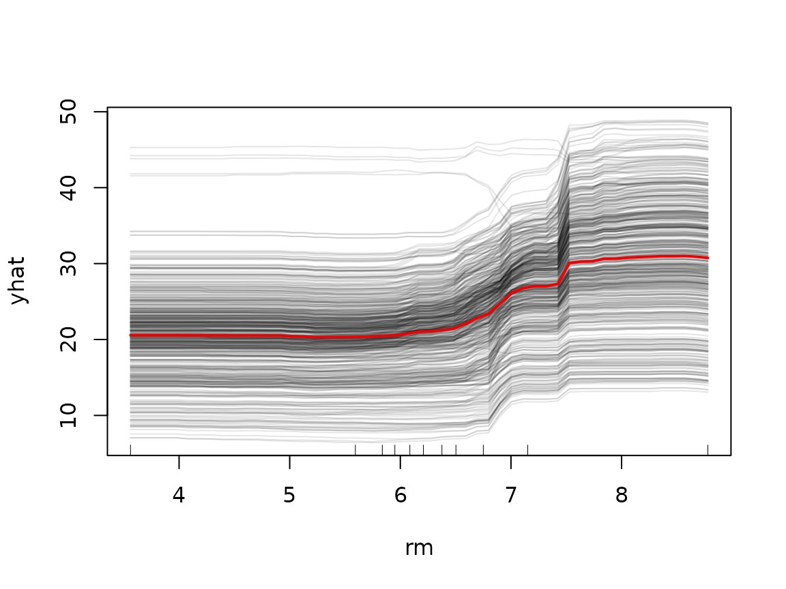
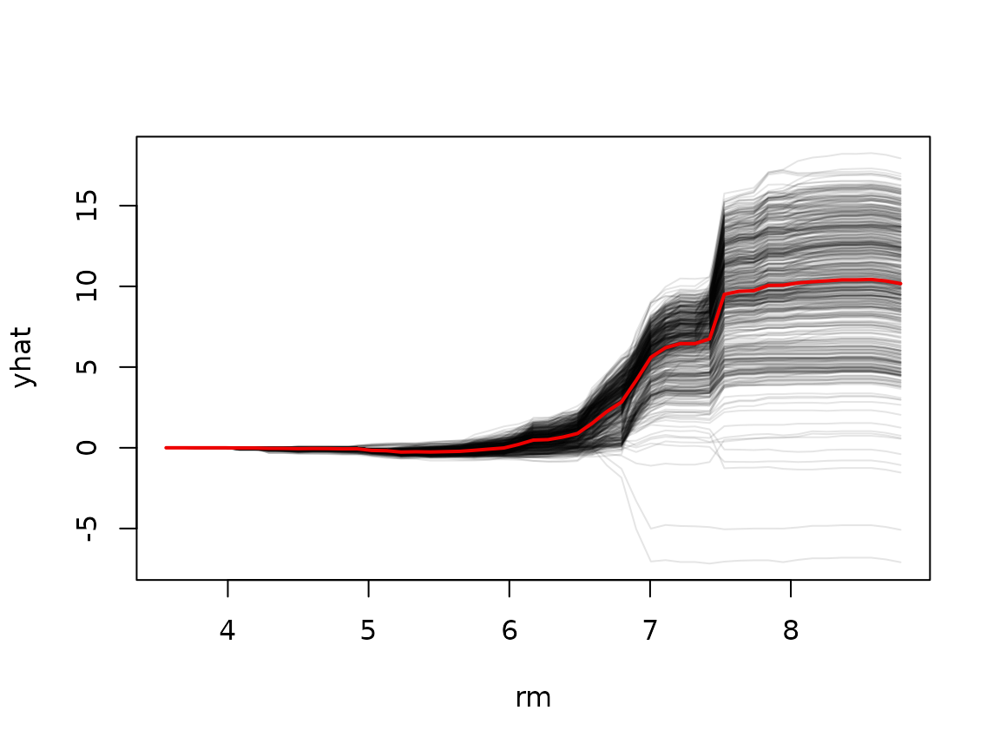

# Individual conditional expectation (ICE) curves

A partial dependence plot shows the *average* effect of a predictor,
which can mask interesting heterogeneity: if a predictor affects
different observations in different ways (e.g., due to interactions),
the average curve may not represent any individual observation well.
*Individual conditional expectation* (ICE) curves (Goldstein et al.,
2015) address this by drawing one curve per observation; the PDP is just
the average of the ICE curves.

## ICE curves

Set `ice = TRUE` in the call to
[`partial()`](https://bgreenwell.github.io/pdp/reference/partial.md)
(ICE curves are only available for a single predictor):

``` r

library(pdp)
library(randomForest)

data(boston)
set.seed(101)
boston.rf <- randomForest(cmedv ~ ., data = boston, ntree = 250)

rm.ice <- partial(boston.rf, pred.var = "rm", ice = TRUE, train = boston)
head(rm.ice)  # one row per observation per grid point
#>        rm     yhat yhat.id
#> 1 3.56100 24.08488       1
#> 2 3.66538 24.08488       1
#> 3 3.76976 24.08488       1
#> 4 3.87414 24.08488       1
#> 5 3.97852 24.08488       1
#> 6 4.08290 24.08488       1
```

The result contains a `yhat.id` column identifying which observation
each prediction belongs to. The
[`plot()`](https://rdrr.io/r/graphics/plot.default.html) method draws
the individual curves along with their average (the PDP) in red:

``` r

plot(rm.ice, alpha = 0.1, rug = TRUE, train = boston)
```



## Centered ICE (c-ICE) curves

When the curves have very different starting points, it can be hard to
judge whether they are parallel (i.e., no interaction). *Centered* ICE
curves force every curve to start at zero, making heterogeneity in the
*shape* of the curves much easier to see. Either set `center = TRUE` in
the call to
[`partial()`](https://bgreenwell.github.io/pdp/reference/partial.md) or
center at plotting time:

``` r

plot(rm.ice, center = TRUE, alpha = 0.1)
```



The divergence of the curves for `rm` above roughly 6.5 indicates an
interaction with at least one other predictor.

## User-supplied prediction functions

The `pred.fun` argument gives full control over how predictions are
generated. It must be a function of exactly two arguments—`object` and
`newdata`—and may return a single (aggregated) prediction or one
prediction per row of `newdata`. Whenever multiple predictions per grid
point are returned, you get ICE-style output automatically.

For example, a random forest is an ensemble, so we could display one
curve per *tree* rather than per observation, or compute a trimmed mean
instead of the usual average:

``` r

# 10% trimmed mean instead of the ordinary average
pred.trimmed <- function(object, newdata) {
  mean(predict(object, newdata = newdata), trim = 0.1)
}

pd.trimmed <- partial(boston.rf, pred.var = "rm", pred.fun = pred.trimmed,
                      train = boston)
plot(pd.trimmed)
```


Similarly, `pred.fun` is the natural way to handle models whose
[`predict()`](https://rdrr.io/r/stats/predict.html) methods need special
arguments or return unusual structures; see
[`vignette("pdp", package = "pdp")`](https://bgreenwell.github.io/pdp/articles/pdp.md)
for the simpler built-in behavior.

## References

Goldstein, A., Kapelner, A., Bleich, J., and Pitkin, E. (2015). Peeking
inside the black box: Visualizing statistical learning with plots of
individual conditional expectation. *Journal of Computational and
Graphical Statistics*, **24**(1), 44–65.
