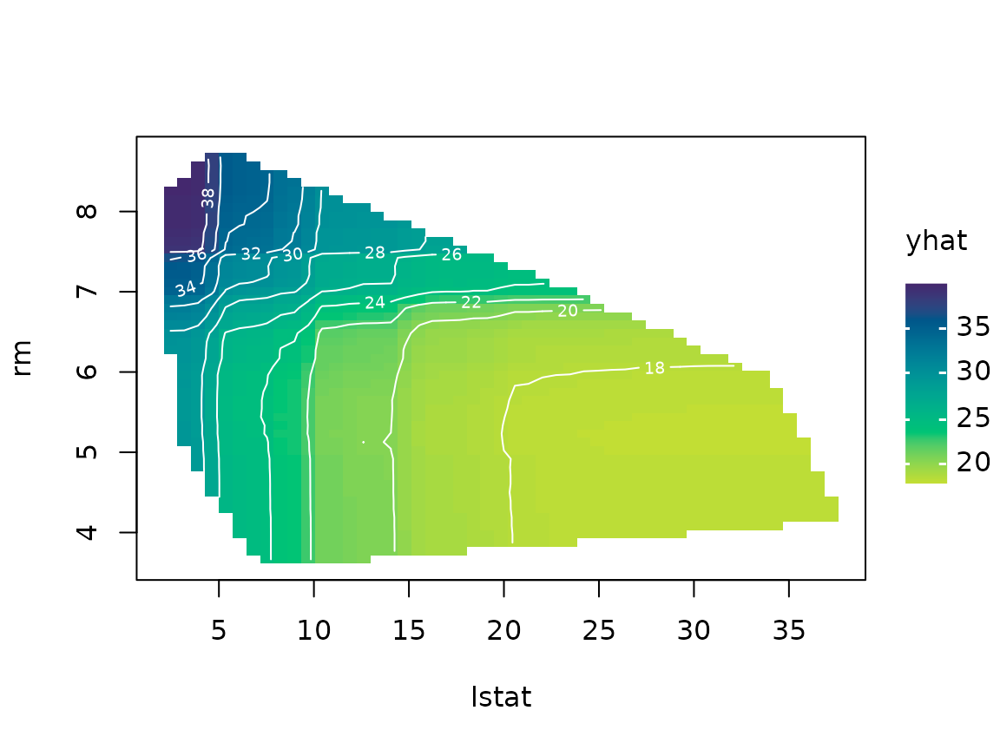
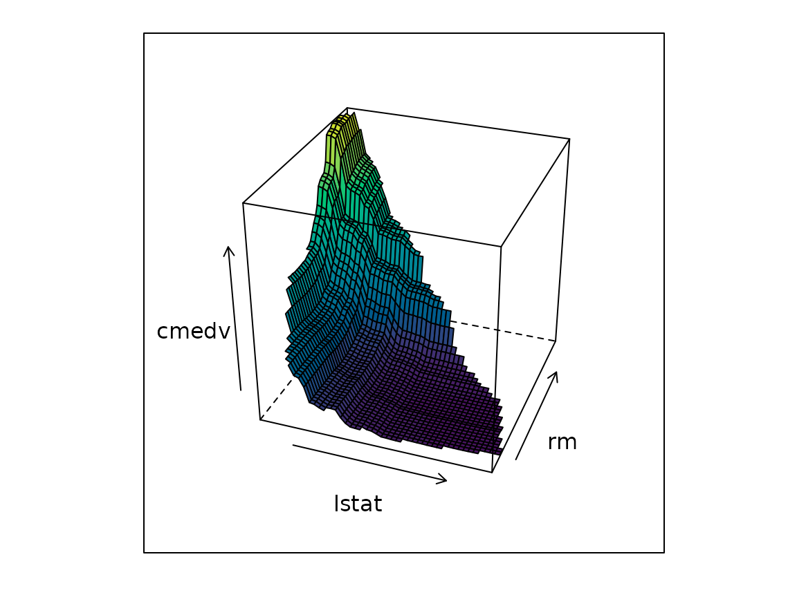
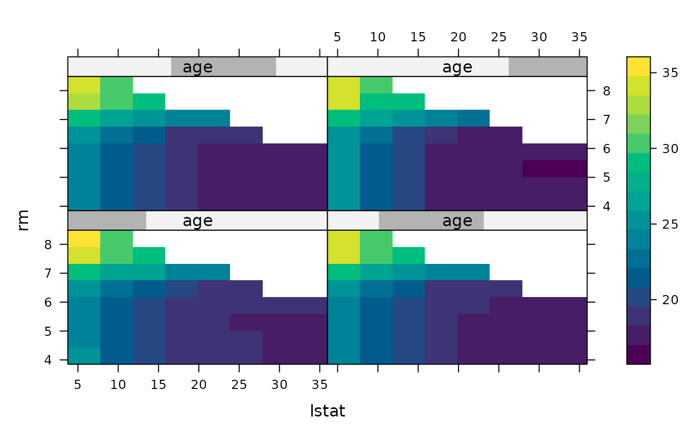

# Introduction to pdp

Complex machine learning models (e.g., random forests and gradient
boosted trees) often predict well but are hard to interpret. *Partial
dependence plots* (PDPs) help visualize the relationship between a
subset of the features (typically 1–3) and the response while accounting
for the average effect of the other predictors in the model. The **pdp**
package provides
[`partial()`](https://bgreenwell.github.io/pdp/reference/partial.md), a
general function for computing partial dependence from a wide variety of
fitted model objects, along with simple plotting methods.

## Installation

**pdp** is hosted on
[r-universe](https://bgreenwell.r-universe.dev/pdp):

``` r

# Install from r-universe (recommended):
install.packages("pdp", repos = c("https://bgreenwell.r-universe.dev",
                                  "https://cloud.r-project.org"))

# Install the latest development version from GitHub:
pak::pak("bgreenwell/pdp")
```

## A first example

We’ll use the Boston housing data (included with **pdp**) and a random
forest. The
[`partial()`](https://bgreenwell.github.io/pdp/reference/partial.md)
function needs (at minimum) a fitted model and the name of the predictor
of interest. It’s good practice to also supply the original training
data via the `train` argument.

``` r

library(pdp)
library(randomForest)

data(boston)  # load the (corrected) Boston housing data
set.seed(101)  # for reproducibility
boston.rf <- randomForest(cmedv ~ ., data = boston, ntree = 250)

# Partial dependence of cmedv on lstat
pd <- partial(boston.rf, pred.var = "lstat", train = boston)
head(pd)
#>    lstat     yhat
#> 1 1.7300 30.90476
#> 2 2.4548 30.90256
#> 3 3.1796 30.85973
#> 4 3.9044 30.39991
#> 5 4.6292 28.81125
#> 6 5.3540 26.90529
```

By default
[`partial()`](https://bgreenwell.github.io/pdp/reference/partial.md)
returns a data frame, which makes it easy to plot with whatever graphics
package you prefer. **pdp** ships with a
[`plot()`](https://rdrr.io/r/graphics/plot.default.html) method that
draws lightweight base R graphics via
[tinyplot](https://grantmcdermott.com/tinyplot/) by default, or
[lattice](https://cran.r-project.org/package=lattice) graphics whenever
`lattice = TRUE`:

``` r

# tinyplot-based display; rug marks show the min/max and deciles of lstat to
# help avoid interpreting the plot where there's little data
plot(pd, rug = TRUE, train = boston)
```


``` r

# lattice-based equivalent
plot(pd, rug = TRUE, train = boston, lattice = TRUE)
```


You can also let
[`partial()`](https://bgreenwell.github.io/pdp/reference/partial.md)
plot directly by setting `plot = TRUE` and choosing a `plot.engine`
(`"tinyplot"`, the default, or `"lattice"`).

## Two predictors

Partial dependence extends naturally to pairs of predictors (the plot
becomes a false color level plot, i.e., heatmap):

``` r

pd2 <- partial(boston.rf, pred.var = c("lstat", "rm"), chull = TRUE,
               train = boston)
plot(pd2, contour = TRUE)
```



Here `chull = TRUE` restricts the grid to the convex hull of the
training values of `lstat` and `rm`, which reduces the risk of
extrapolating outside the region of the data. Factor predictors are
handled automatically and result in faceted displays.

## 3-D surfaces and three predictors (lattice)

The lattice engine (`lattice = TRUE`) additionally supports 3-D surfaces
and paneled three-predictor displays, like the figures in the [R Journal
paper](https://journal.r-project.org/articles/RJ-2017-016/):

``` r

# 3-D surface instead of a false color level plot
plot(pd2, lattice = TRUE, levelplot = FALSE, zlab = "cmedv", drape = TRUE,
     colorkey = FALSE, screen = list(z = -20, x = -60))
```



``` r

# Three predictors: the third is binned into overlapping intervals and used
# to panel the display (see the `number` and `overlap` arguments)
pd3 <- partial(boston.rf, pred.var = c("lstat", "rm", "age"),
               grid.resolution = 10, chull = TRUE, batch.size = 1e6,
               train = boston)
plot(pd3, lattice = TRUE)
```



## Classification

For classification models, partial dependence is computed for the
predicted probability of the “focus” class (the first class, by default;
use `which.class` to change it) on the centered logit scale. Set
`prob = TRUE` to use the probability scale instead:

``` r

data(pima)  # load the Pima Indians diabetes data
pima2 <- na.omit(pima)
set.seed(102)
pima.rf <- randomForest(diabetes ~ ., data = pima2, ntree = 250)

# Partial dependence of the probability of testing positive on glucose
partial(pima.rf, pred.var = "glucose", prob = TRUE, which.class = "pos",
        plot = TRUE, rug = TRUE, train = pima2)
```


## Models with non-Gaussian responses

Some models make predictions on a transformed scale (e.g., Poisson
models often predict on the log scale). Use `inv.link` to transform the
predictions back to the response scale *before* the partial dependence
function is computed:

``` r

fit <- glm(carb ~ ., data = mtcars, family = poisson)

# Partial dependence of the number of carburetors on mpg (response scale)
partial(fit, pred.var = "mpg", inv.link = exp, plot = TRUE, train = mtcars)
```


## Controlling the grid

By default,
[`partial()`](https://bgreenwell.github.io/pdp/reference/partial.md)
evaluates continuous predictors over an equally spaced grid of (at most)
51 values spanning their range. This can be controlled via:

- `grid.resolution` — the number of equally spaced grid points;
- `quantiles = TRUE` — use sample quantiles (see `probs`) instead, which
  keeps the grid inside the bulk of the data;
- `trim.outliers = TRUE` — trim outliers before constructing the grid;
- `pred.grid` — supply the exact grid of values yourself.

``` r

partial(boston.rf, pred.var = "lstat", quantiles = TRUE, probs = 1:19/20,
        plot = TRUE, train = boston)
```


## Learn more

- [`vignette("ice-curves", package = "pdp")`](https://bgreenwell.github.io/pdp/articles/ice-curves.md)
  covers *individual conditional expectation* (ICE) curves and
  user-supplied prediction functions.
- [`vignette("faster-pdp", package = "pdp")`](https://bgreenwell.github.io/pdp/articles/faster-pdp.md)
  covers options for speeding up the computations (e.g., batched
  predictions and parallel processing).
- The R Journal article [“pdp: An R Package for Constructing Partial
  Dependence
  Plots”](https://journal.r-project.org/articles/RJ-2017-016/) provides
  a detailed introduction.
